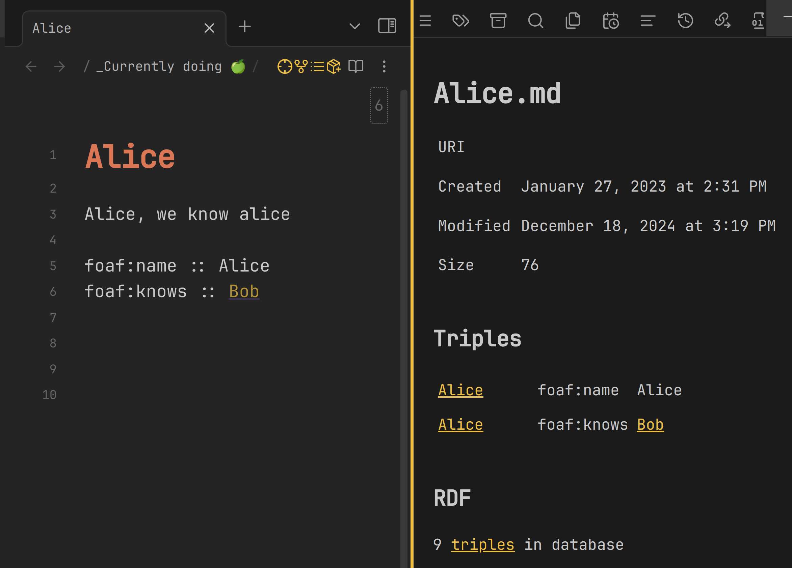
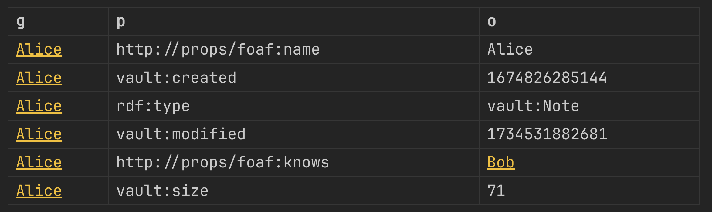
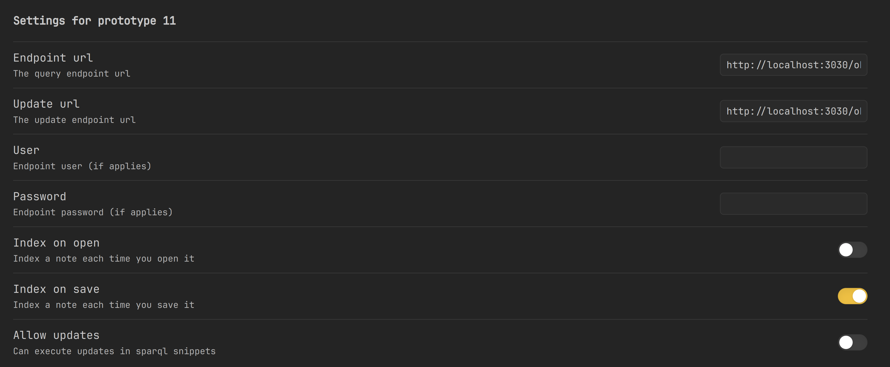

# Prototype 11

Allows indexing and querying your notes' RDF from Obsidian. 

Status: exploration

## Collecting RDF

Each time you save a file, RDF triples are extracted and indexed in the triplestore.

There is a debug panel to lookup the triples.



## Queries

Prototype-11 uses a dialect of SPARQL that allows to embed references to markdown notes. It's very simple, it just rewrites any occurrence of `[[note]]` by a known `<URI>` .

You can use them in sparql code-block like this:

```sparql
SELECT ?g ?p ?o WHERE {
 GRAPH ?g {
		 [[Alice]] ?p ?o
	 }
} LIMIT 6
```

Obsidian will help you to autocomplete the entities in `[[]]`

Later on, such code-blocks are then rendered inline, and will contain clickable links in case of known entities. 



This is similar to data-view in functionality, but with the expresiveness of SPARQL, and the possibility of federating external sources

## Config

Setup your triplestore in the options menu


